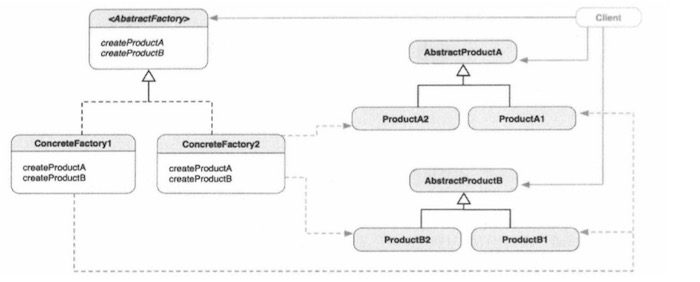
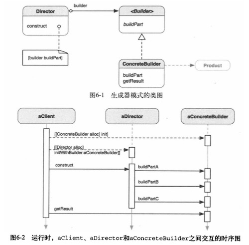
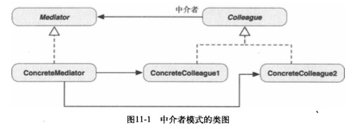
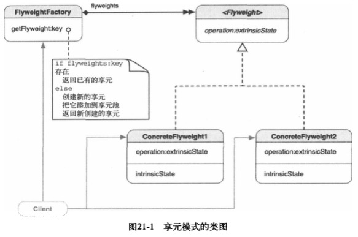
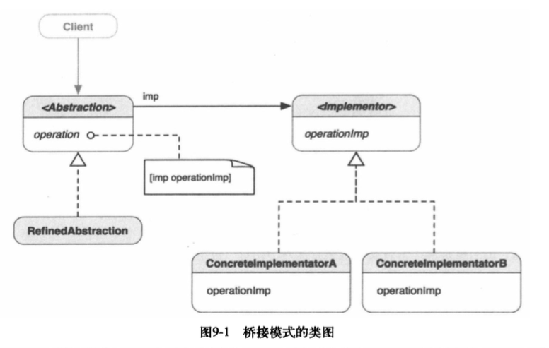

# 工程框架设计

## MVVM 框架

## 用到的设计模式

### 抽象工厂模式应用
抽象工厂模式类图

### 生成器设计模式应用
生成器模式类图

### 观察者模式应用
观察者模式类图

### 中介者模式应用
中介者模式类图

工程中切换视图用的是中介者模式，利用一个中介者来统一管理视图的切换。

定义了一个类叫做 `ViewControllerSwitchMediator`

### 享元模式应用
享元模式类图

### 桥接模式应用
定义：将抽象部分与它的实现部分分离，使他们都可以独立的变化。

桥接模式类图

